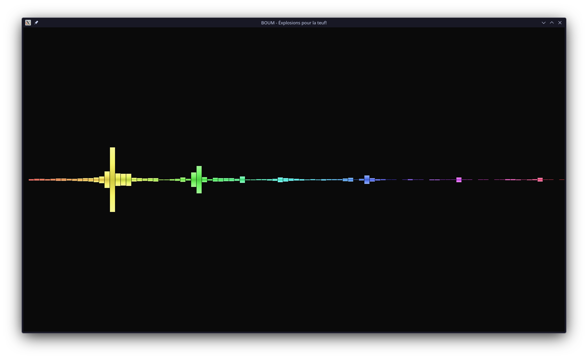

# boum

C'est une sacrée boum quand vous allumez ce programme !

Music visualizer with fancy effects.



## Build

```bash
make -f desktop.mk
```

## Run

The last 2 arguments are optional in that order, meaning you can change the fps if you supply an output file.

The program runs a separate FFMPEG pipe that inputs the raw frames at the supplied frame rate. If you don't care for the output, then simply leave out the _output-file_ and _fps_.

```bash
./build/boum <input-file> <output-file> <fps>
```

## Resources

- [Tsoding](https://www.youtube.com/watch?v=Xdbk1Pr5WXU&list=PLpM-Dvs8t0Vak1rrE2NJn8XYEJ5M7-BqT&index=1&pp=iAQB)

  - The project was heavily influenced by Tsoding's Recreational Programming!

- [3B1B Fourier Transform](https://www.youtube.com/watch?v=spUNpyF58BY&t=398s&pp=ygUTM2JsdWUxYnJvd24gZm91cmllcg%3D%3D)
- [3B1B DFT](https://www.youtube.com/watch?v=g8RkArhtCc4)
- [Rosetta Code FFT Implementation](https://rosettacode.org/wiki/Fast_Fourier_transform#Python:h_Recursive)
